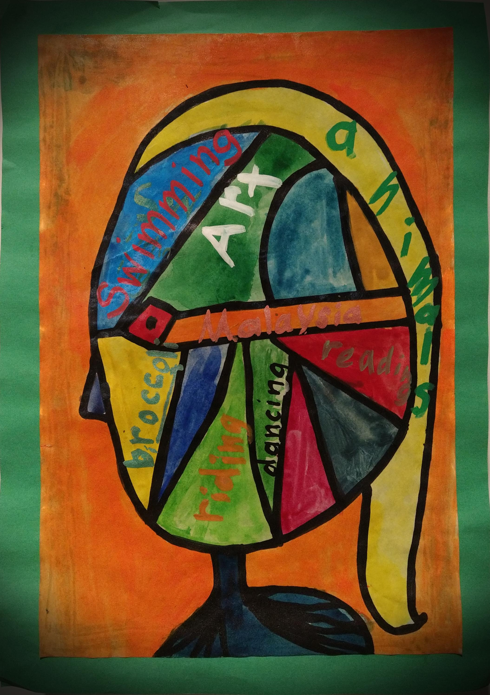

## Home

{:style="float: right" width="30%"}

### My Research
Usually contains:
- Your role, to distinguish you from other people with potentially the same name
- A short description of your research interests
- Your contact details

A hyperlink [to another website](https://ong-home.my)

### About Me

A short paragraph of text describing your history. 
So that people who invite you to present can advertise your talk, and introduce you as a speaker at the beginning of the talk.
